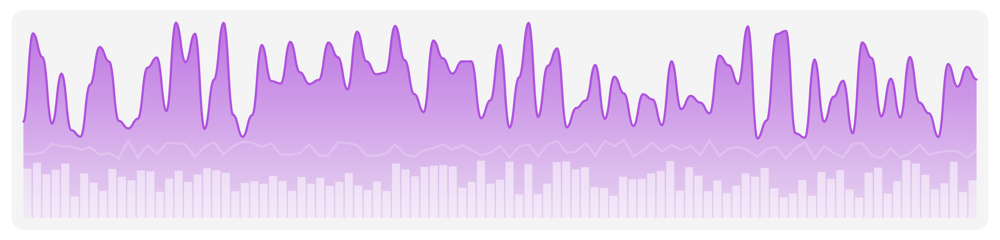
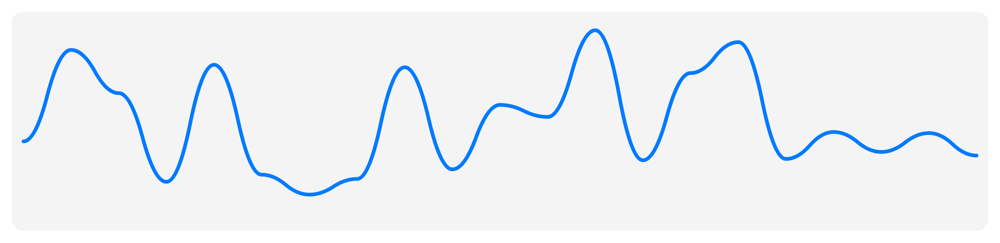
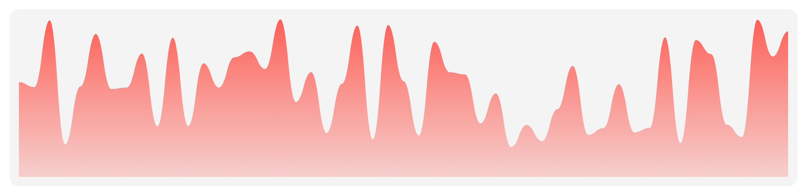
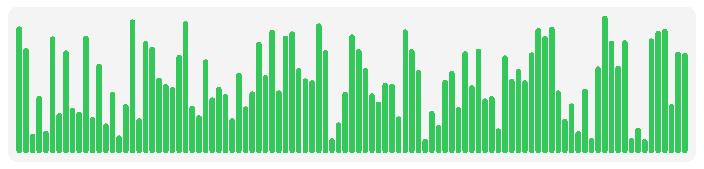

# SwiftUI Charts

<p align="center">
<a href="https://travis-ci.org/laravel/framework"></a>
<a href="https://packagist.org/packages/laravel/framework"></a>
<a href="https://packagist.org/packages/laravel/framework"></a>
<a href="https://packagist.org/packages/laravel/framework"></a>
</p>

Build custom charts with SwiftUI

<center>

</center>

## Styles

### Line
<center>

</center>

```swift
Chart(data: [0.1, 0.3, 0.2, 0.5, 0.4, 0.9, 0.1])
    .chartStyle(
        LineChartStyle(.quadCurve, lineColor: .blue, lineWidth: 5)
    )
```

### Area
<center>

</center>

```swift
Chart(data: [0.1, 0.3, 0.2, 0.5, 0.4, 0.9, 0.1])
    .chartStyle(
        AreaChartStyle(.quadCurve, fill:
            LinearGradient(gradient: .init(colors: [Color.blue.opacity(0.2), Color.blue.opacity(0.05)]), startPoint: .top, endPoint: .bottom)
        )
    )
```

### Stacked Area

```swift
Chart(data: matrix)
    .chartStyle(
        StackedAreaChartStyle(.quadCurve, colors: [.yellow, .orange, .red])
    )
```

### Column
<center>

</center>

```swift
Chart(data: [0.1, 0.3, 0.2, 0.5, 0.4, 0.9, 0.1])
    .chartStyle(
        ColumnChartStyle(column: Capsule().foregroundColor(.green), spacing: 2)
    )
```

### Stacked Column

```swift
Chart(data: matrix)
    .chartStyle(
        StackedColumnChartStyle(spacing: 2, colors: [.yellow, .orange, .red])
    )
```

## Roadmap
-  Bar chart style

## Code Contributions
Feel free to contribute via fork/pull request to master branch. If you want to request a feature or report a bug please start a new issue.
